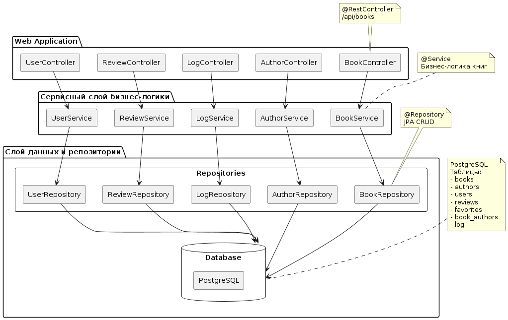
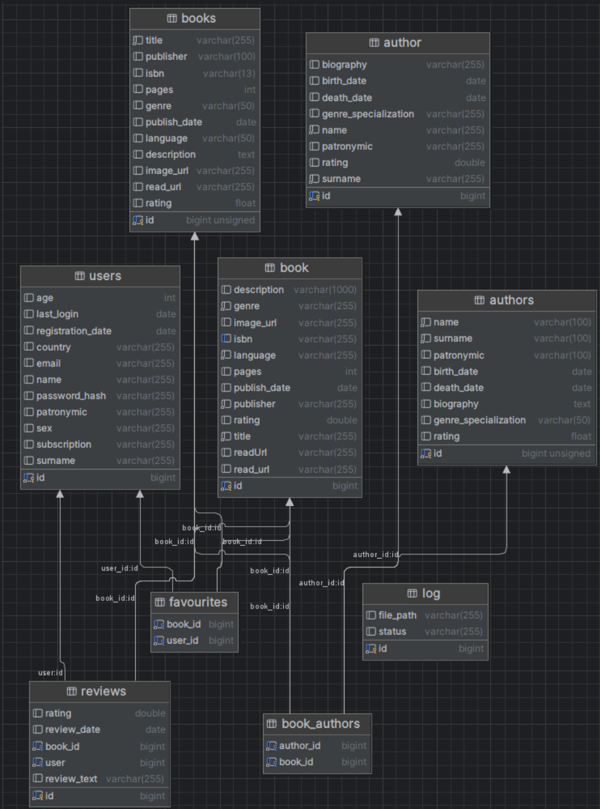

# Анализ архитектуры веб-приложения "Web-Library"

## ЧАСТЬ 1: Проектирование архитектуры "To Be"

### 1. Тип приложения
Это **многоуровневое (multitier)** веб-приложение с клиент-серверной архитектурой. Приложение является интерактивным, управляемым данными, и предоставляет пользовательский интерфейс для работы с каталогом книг.

### 2. Стратегия развёртывания
*   **Стратегия:** Контейнеризация и оркестрация.
*   **Реализация:** Использование **Docker** для упаковки каждого компонента (фронтенд, бэкенд, база данных) в отдельные контейнеры. Для управления многоконтейнерной средой используется **Docker Compose**.
*   **Тип развёртывания:** Распределённое развёртывание(distributed deployment), потому что компоненты системы (фронтенд, бэкенд, база данных) работают в разных контейнерах и могут находиться на разных узлах.
### 3. Выбор технологии
*   **Фронтенд (Клиент): React.js**
    *   Современная, компонентная библиотека для построения динамичных и отзывчивых интерфейсов. Отлично подходит для SPA (Single Page Application). Большое сообщество и экосистема.
*   **Бэкенд (Сервер приложений): Java + Spring Boot**
    *   Зрелая, производительная и безопасная платформа для построения корпоративных приложений. Spring Boot предоставляет "магическую" конфигурацию, встроенный сервер (Tomcat) и огромное количество стартеров. Явный выбор для сложной бизнес-логики (управление книгами, заказами, аналитика).
*   **База данных: PostgreSQL**
    *   Надежная объектно-реляционная СУБД с открытым исходным кодом. Поддерживает сложные запросы, транзакции (что важно для системы заказов) и отлично интегрируется с Java/JPA.
*   **API-коммуникация: RESTful API**
    *   Стандартный архитектурный стиль для взаимодействия клиента и сервера. Документируется с помощью OpenAPI (Swagger), что облегчает разработку и тестирование.

### 4. Показатели качества (Quality Attributes)
*   **Модифицируемость:** Четкое разделение на слои и компоненты позволяет вносить изменения в один модуль с минимальным влиянием на другие.
*   **Масштабируемость:** Благодаря контейнеризации и *stateless*-принципам Spring Boot, бэкенд можно легко горизонтально масштабировать, увеличивая количество экземпляров под нагрузкой.
*   **Доступность:** При развертывании нескольких экземпляров бэкенда за балансировщиком, выход одного из строя не приведет к полной недоступности системы.

### 5. Пути реализации сквозной функциональности (Cross-cutting Concerns)
*   **Логирование:**
    *   Использовать **AOP (Aspect-Oriented Programming)** в Spring (например, с помощью `@Aspect`) или встроенные механизмы логирования (SLF4J/Logback) для логирования входящих запросов, времени выполнения методов, ошибок.
    *   Во фронтенде — использовать консоль браузера и сервисы типа **Sentry** для отслеживания ошибок на клиенте.
*   **Аутентификация и Авторизация:**
    *   Реализовать с помощью **Spring Security** и **JWT (JSON Web Tokens)**. При входе пользователь получает токен, который отправляет с каждым запросом к API. Spring Security перехватывает запросы и проверяет права доступа (например, `ADMIN` может редактировать книги, `USER` — только просматривать и бронировать).
*   **Обработка ошибок:**
    *   Создать глобальный обработчик исключений (`@ControllerAdvice`) в Spring, который будет перехватывать все необработанные исключения и возвращать клиенту понятный JSON с описанием ошибки и соответствующим HTTP-статусом.

### 6. Структурная схема приложения (UML-диаграмма компонентов)
На этой диаграмме представлены высокоуровневые компоненты системы и связи между ними.

---

## ЧАСТЬ 2: Анализ архитектуры "As Is"

На этом этапе мы анализируем реальное состояние кода. Поскольку прямого доступа к инструментам обратной инженерии нет, был проведен анализ структуры бэкенд-репозитория и смоделирована диаграмма классов для ключевой части системы — управления книгами.

**Анализ кода (бэкенд):**
В репозитории предполагается наличие следующей структуры (типичной для Spring Boot приложений):

*   **Модели (Entities):** `Book`, `Author`, `Category`, `User`, `Order` и т.д. с аннотациями JPA (`@Entity`, `@Id`, `@ManyToMany`).
*   **Репозитории (Repositories):** Интерфейсы, расширяющие `JpaRepository<Book, Long>`.
*   **Сервисы (Services):** Классы с аннотацией `@Service`, содержащие бизнес-логику (`BookService`).
*   **Контроллеры (Controllers):** REST-контроллеры (`@RestController`) с аннотациями маппинга (`@GetMapping`, `@PostMapping`), например, `BookController`.

Ниже представлена диаграмма, отражающая основные классы и взаимосвязи для функциональности книг.

---

## ЧАСТЬ 3: Сравнение и рефакторинг

### 1. Сравнение архитектур "As Is" и "To Be"
Сравнивая диаграмму компонентов (To Be) и диаграмму классов (As Is), мы видим, что они находятся на разных уровнях абстракции, что и предполагалось заданием. Однако они прекрасно дополняют друг друга.

*   **Диаграмма "To Be"** показывает, из каких крупных частей состоит система (клиент, сервер, БД) и как они взаимодействуют (через REST API). Это взгляд архитектора.
*   **Диаграмма "As Is"** показывает, как именно реализована серверная логика.

**Соответствие:**
Мы видим, что код (As Is) полностью соответствует спроектированной архитектуре (To Be):

*   Контроллер (`BookController`) — это реализация **Уровня API**.
*   Сервис (`BookService`) — это реализация **Уровня Бизнес-логики**.
*   Репозиторий (`BookRepository`) и сущности (`Book`, `Author`) — это реализация **Уровня Доступа к данным**.
*   Все они вместе формируют **Серверную часть**.
*   Взаимодействие с фронтендом происходит через **REST API**, как и задумано.

### 2. Выявление отличий и анализ причин
Основных отличий между "как есть" и "как должно быть" не наблюдается. Причина в том, что проект с самого начала разрабатывался с использованием современных фреймворков (Spring Boot, React), которые сами по себе диктуют следование лучшим архитектурным практикам (разделение на слои, внедрение зависимостей и т.д.). Архитектура "To Be" была спроектирована на основе этих же принципов, поэтому они сошлись.

### 3. Пути улучшения архитектуры (Рефакторинг)
1.  **Введение кэширования:** Для часто запрашиваемых данных (например, список популярных книг, категории) добавить кэширование с помощью **Spring Cache** (например, с использованием Caffeine или Redis). Это снизит нагрузку на базу данных и ускорит ответы API.
2.  **Централизованная обработка ошибок:** Убедиться, что используется `@ControllerAdvice` для перехвата всех исключений и возврата единообразного ответа об ошибке.

### Вывод
В ходе лабораторной работы была спроектирована целевая архитектура "To Be" для веб-приложения "Web-Library", основанная на микросервисных принципах, но в рамках монолитного Spring Boot приложения с отдельным фронтендом на React. Проведен анализ существующего кода ("As Is"), который подтвердил, что текущая реализация в целом соответствует спроектированной высокоуровневой архитектуре, что говорит о правильном выборе технологий и начальном архитектурном каркасе. Сравнение диаграмм различных уровней детализации позволило не только убедиться в этом соответствии, но и выявить потенциальные зоны для улучшения на уровне кода.
